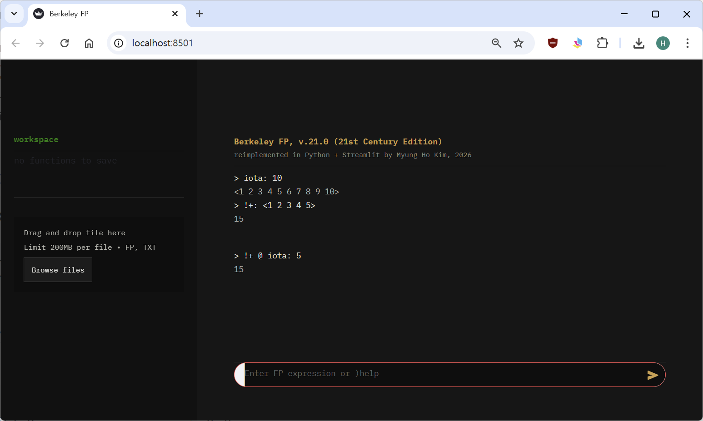

# Berkeley FP — 21st Century Edition

A modern reimplementation of the **Berkeley FP interpreter** from 4.2BSD (1983), built with Python and Streamlit.

FP is the functional programming language introduced by John Backus in his 1977 Turing Award lecture, *"Can Programming Be Liberated from the von Neumann Style?"* — a radical vision of programming without variables, assignments, or loops, where everything is built from function composition.

The original Berkeley FP ran on VAX-11 under 4.2BSD. This version runs in your browser.



## Quick Start

```bash
pip install streamlit
streamlit run fp_app.py
```

## The Language

FP has no variables. Every program is a function applied to a value with `:`.

```
first : <1 2 3>                       ⟶  1
tl : <1 2 3>                          ⟶  <2 3>
2 : <a b c>                           ⟶  b
```

Functions are combined with operators — never with variables:

| Syntax | Name | Example |
|--------|------|---------|
| `f : x` | apply | `first : <1 2 3>` → `1` |
| `f @ g` | composition | `first @ tl : <1 2 3>` → `2` |
| `&f` | apply-to-all (map) | `&first : <<1 2> <3 4>>` → `<1 3>` |
| `!f` | insert (foldr) | `!+ : <1 2 3 4>` → `10` |
| `\f` | left-insert (foldl) | `\- : <1 2 3>` → `-4` |
| `[f g h]` | construction | `[first last] : <1 2 3>` → `<1 3>` |
| `p -> f ; g` | condition | `(null -> %0 ; length) : <>` → `0` |
| `%x` | constant | `%42 : <anything>` → `42` |
| `n` | selector | `2 : <a b c>` → `b` |

User-defined functions use `{}`:

```
{double * @ [id %2]}
double : 7                             ⟶  14
```

## Quicksort in FP

No variables. No loops. Pure function composition.

```
{le not @ gt}
{filter_le null @ 2 -> %<> ; (le @ [first @ 2, 1]) -> (apndl @ [first @ 2, filter_le @ [1, tl @ 2]]) ; filter_le @ [1, tl @ 2]}
{filter_gt null @ 2 -> %<> ; (gt @ [first @ 2, 1]) -> (apndl @ [first @ 2, filter_gt @ [1, tl @ 2]]) ; filter_gt @ [1, tl @ 2]}
{qsort null -> %<> ; (null @ tl) -> [1] ; (concat @ [qsort @ filter_le @ [first, tl], apndl @ [first, qsort @ filter_gt @ [first, tl]]])}

qsort : <3 1 4 1 5 9 2 6>             ⟶  <1 1 2 3 4 5 6 9>
```

## More Examples

**Factorial** — recursive, no variables:
```
{eq0 eq @ [id %0]}
{sub1 - @ [id %1]}
{fact eq0 -> %1 ; (* @ [id fact @ sub1])}
fact : 6                               ⟶  720
```

**Inner product** — composition of insert, map, and transpose:
```
{ip (!+) @ (&*) @ trans}
ip : <<1 2 3> <4 5 6>>                ⟶  32
```

**Sum of 1 to N** — insert addition over iota:
```
!+ @ iota : 10                         ⟶  55
```

**Increment all** — map with constant:
```
&(+ @ [id %1]) : <1 2 3>              ⟶  <2 3 4>
```

## Primitives

**Structure:** `first` `last` `tl` `tlr` `reverse` `rotl` `rotr` `length` `pick` `concat` `pair` `split` `iota` `trans`

**Construct:** `apndl` `apndr` `distl` `distr`

**Arithmetic:** `+` `-` `*` `/` `mod`

**Comparison:** `=` `lt` `gt` `le` `ge` `ne`

**Logic:** `not` `and` `or`

**Tests:** `atom` `null` `eq`

**Other:** `id` `out`

## Commands

| Command | Description |
|---------|-------------|
| `)help` | Show help |
| `)fns` | List user-defined function names |
| `)pfn` | Show all function definitions |
| `)pfn name` | Show specific function definition(s) |
| `)undef name` | Delete a function |
| `)prims` | List all primitive functions |
| `)reset` | Clear all user functions |
| `)save name` | Download workspace as `.fp` file |
| `)load` | Upload a `.fp` file |
| `)ex` | Show built-in examples |

## Design Notes

The constant operator `%` follows the original Berkeley FP manual. Backus's paper used x̄ (overbar), which ASCII terminals rendered as `%`. The tilde `~` is also accepted for compatibility with other FP implementations.

The entire interpreter — parser, evaluator, and UI — is a single Python file (~1,000 lines). The parser is a recursive-descent Pratt-style parser with correct operator precedence. The evaluator supports full recursion with a configurable step limit.

## References

- J. Backus, ["Can Programming Be Liberated from the von Neumann Style?"](https://dl.acm.org/doi/10.1145/359576.359579), *Comm. ACM* 21(8), 1978
- S. Baden, *Berkeley FP User's Manual, Rev. 4.2*, in UNIX Programmer's Manual, 4.2BSD, Vol. 2C, §50, 1983
- [FP on Wikipedia](https://en.wikipedia.org/wiki/FP_(programming_language))

## License

MIT

## Author

**Myung Ho Kim**, 2026
